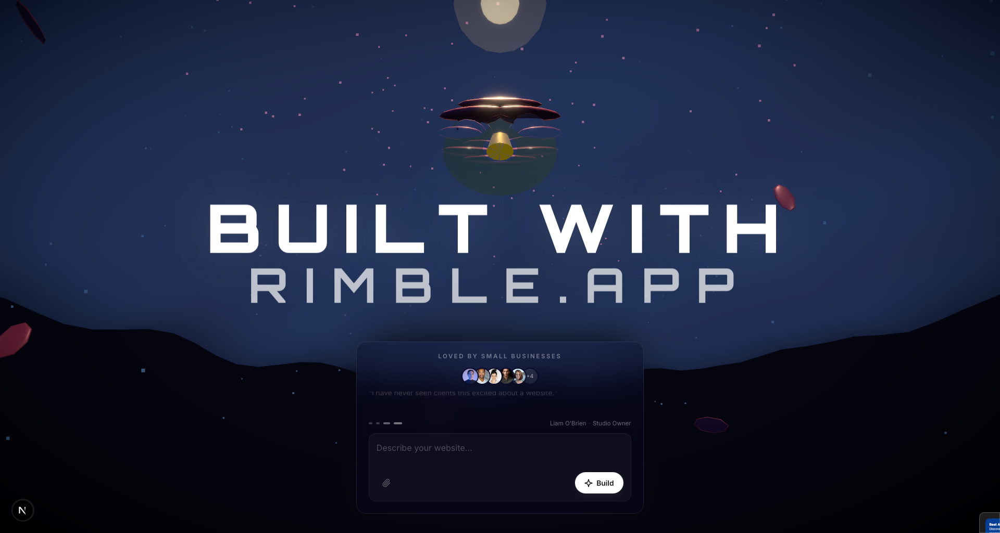

<div align="center">
  <br />
  <h1>Acheron-Protocol</h1>
  <p>
    <strong>On-demand, zero-persistence ephemeral endpoints for secure SMS and Email routing.</strong>
  </p>
  <br />
  
  <br />
</div>

<hr />

## 🛡 Overview

Acheron Link (Protocol) was engineered to solve a modern web crisis: the aggressive collection of personal phone numbers and emails by services, marketers, and tracking networks. 

We provide on-demand, disposable gateway nodes to give you complete control over your digital perimeter. Generate self-destructing SMS and Email routing links that vanish from existence the moment their timer expires. No sign-ups, no tracking, just instant communication cloaking.

## ✨ Features

- **Zero Logs, Absolute Privacy** 
  We do not store, log, or cache your received messages. Once your session duration expires, the endpoint is completely torn down and all routed data is permanently wiped from our memory nodes.
- **Bypass Comm Walls** 
  Use our global routing nodes to bypass mandatory registration forms, sketchy downloads, or verification checkpoints. Keep your real inbox clean and your personal phone number protected from marketing trackers and data breaches.
- **Ephemeral Architecture**
  Set custom Time-To-Live (TTL) durations ranging from 1 hour to 2 weeks. The infrastructure physically enforces the teardown of your gateway when the clock runs out.
- **Real-Time WebSockets**
  Incoming intercepts are streamed instantly to your tactical dashboard via low-latency WebSockets.

## 💻 Tech Stack

- **Frontend Core**: [Next.js](https://nextjs.org/) (React)
- **Styling**: [Tailwind CSS](https://tailwindcss.com/) with a custom dark-mode, cyberpunk typography system (Space Grotesk & Manrope).
- **Icons**: [Lucide React](https://lucide.dev/)
- **State & UI**: Radix UI, Framer Motion
- **Backend (Mock)**: Node.js, Express, Socket.io (Simulates carrier network routing).

## 🚀 Getting Started

### Prerequisites
- Node.js (v18+)
- npm or yarn or pnpm

### Installation

1. Clone the repository and install dependencies for the monorepo:
```bash
npm install
```

2. Start the local Carrier Mock Server (Handles WebSockets & OTP simulation):
```bash
node services/gateway/mock-server.mjs
```

3. Open a new terminal and start the Next.js Frontend:
```bash
cd apps/web
npm run dev
```

4. Navigate to `http://localhost:3000` to access the Acheron Link Dashboard.

## 🧪 Developer Sandbox (Testing)

Because the local server isn't exposed to the public telecom grid (Twilio/SendGrid), a **Developer Control Overlay** is included to simulate inbound transmissions.

1. Launch the application.
2. Click the floating **Lightning Bolt** action button in the bottom right corner of the dashboard.
3. Use the injection panel to fire simulated SMS or Email payloads directly into your active routing nodes.

## 📄 License

This project is licensed under the [MIT License](LICENSE).
